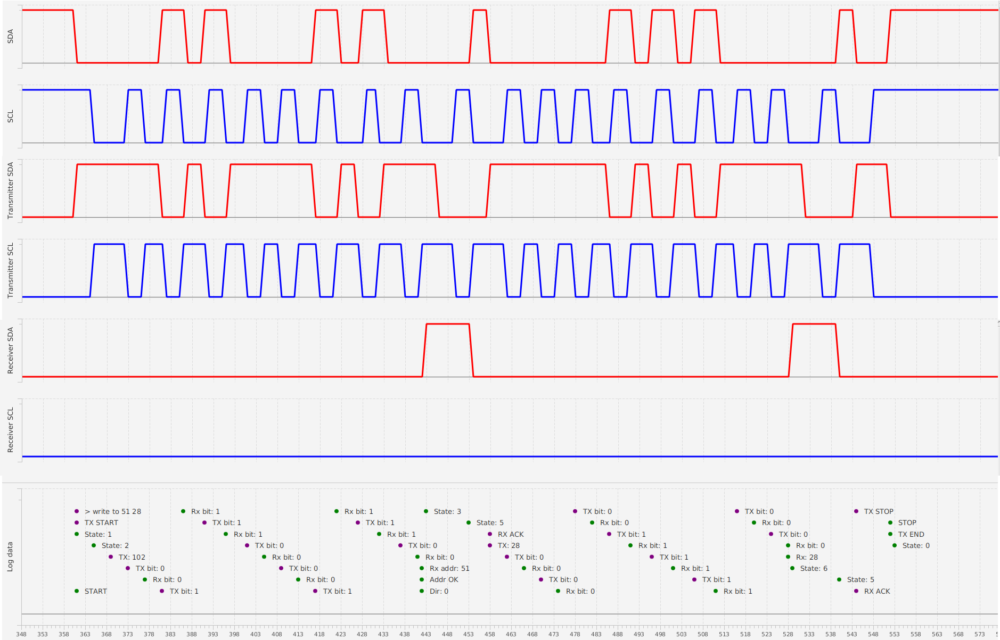
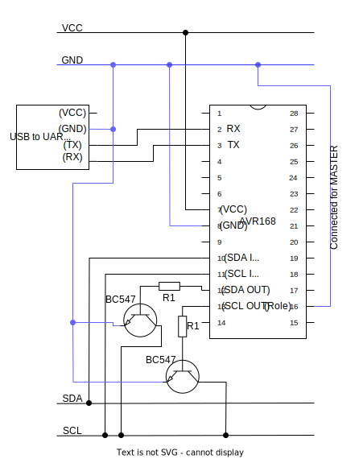
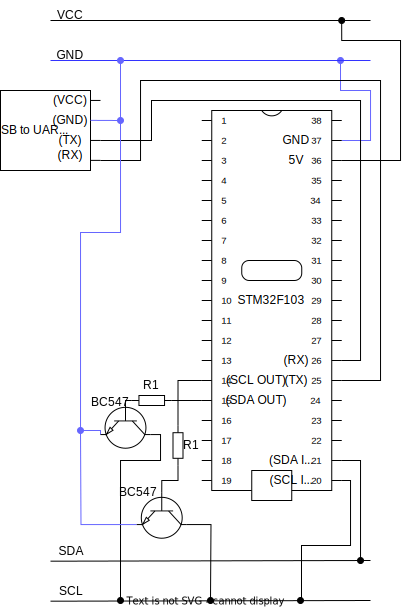

# Cross compiled I2C
A demo/development platform for software-based I2C protocol. </br>
It can be run on a desktop by starting two instances of the executable that communicate with each other using a JSON file or it can be build and uploaded to run on the AVR/STM32 microcontrollers. </br>
Each target platform is using the same version of the [I2C library](https://github.com/mateuszbugaj/GenericI2C) by compiling the appropriate HAL implementation and has a common console source code for control.



There are scripts for each target platforms that help with deployment under `utils/`. </br>
The [logic analyzer](https://github.com/mateuszbugaj/SimpleLogicAnalyzer) can be used to examine the transmission.
## Desktop platform
Create the build-system
```
cmake -S . -B build-desktop/ -DTARGET_PLATFORM=DESKTOP
```

Build executable
```
cmake --build build-desktop/
```

Run `transmitter` instance
```
build-desktop/src/desktop/DesktopDemo --role=1
```

Run `receiver` instance
```
build-desktop/src/desktop/DesktopDemo --role=2
```

The HAL implementation is using `output/pin_states.json` instead of real MCU pins to read and write to the I2C bus. </br>
Each new pin output generates new line which contains the state of pins and the calculated bus state.
```JSON
{"timestamp":"16:02:59.415","signals":[{"MASTER_SCL_OUT":0},{"MASTER_SDA_OUT":0},{"SLAVE_SCL_OUT":0},{"SLAVE_SDA_OUT":0}],"SCL":1,"SDA":1}
```

Other files in the `output/` directory such as `logic_analyzer_snapshot.txt`, `master_log.txt` or `slave_log.txt` can be used by [logic analyzer](https://github.com/mateuszbugaj/SimpleLogicAnalyzer) by providing the filenames in the analyzer-properties file.
```json
{
  "logicProbe": { "file": "/path/to/the/logic_analyzer_snapshot.txt" },
  "loggingProbe": [
    { "name": "Transceiver", "file": "/path/to/the/master_log.txt" },
    { "name": "Receiver", "file": "/path/to/the/slave_log.txt"}
  ],
  "signals": ["SDA", "SCL", "Transmitter SDA", "Transmitter SCL", "Receiver SDA", "Receiver SCL"]
}
```


## AVR platform
### Build and upload
```
cmake -S . -B build-avr/ -DTARGET_PLATFORM=AVR -DCMAKE_TOOLCHAIN_FILE=cmake/avr/avr-toolchain.cmake
cmake --build build-avr/
sudo make -C build-avr/ upload_AvrDemo
```
Or by using `utils/build-avr.sh`.

### Schematics


The value of $R1$ resistors is calculated to achieve base current $I_B$ sufficient of saturaing `BC547` BJTs with the load of I2C bus current $I_C$. The current gain required for saturation is assumed to be $h_{FE}\cdot\frac{1}{10}=10$ and $V_{BE}=0.7V$.
$$I_C=\frac{5V}{10k\Omega}=0.5mA$$
$$I_B=\frac{I_C}{h_{FE}\cdot\frac{1}{10}}=0.05mA$$
$$R1 = \frac{V-V_{BE}}{I_B}=86k\Omega$$

## STM32 platform
### Build and upload
```
cmake -S . -B build-stm32/ -DTARGET_PLATFORM=STM32 -DCMAKE_TOOLCHAIN_FILE=cmake/stm32/stm32-toolchain.cmake
cmake --build build-stm32/
sudo make -C build-stm32/ Stm32Demo.bin_upload
```
Or by using `utils/build-stm32.sh`.

### Schematics


## Control
Each of the deployments allows for control of the I2C library using the console from `src/common/console.c`.

### Get Commands
These commands are used to retrieve current settings of the I2C configuration.

- get role: Returns the current role of the I2C device (MASTER or SLAVE).
- get address: Returns the current I2C address.
- get time_unit: Returns the current time unit setting.
- get logging_level: Returns the current logging level (0-5).
- get scl: Returns the current level of the SCL pin.
- get sda: Returns the current level of the SDA pin.

### Set Commands
These commands are used to set various parameters of the I2C configuration.

- set role [master/slave]: Sets the role of the I2C device.
- set address [0-127]: Sets the I2C address.
- set time_unit [0-1000]: Sets the time unit.
- set logging_level [0-5]: Sets the logging level.
### Write Commands
These commands are specific to writing operations in I2C communication.

- write byte [0-255]: Writes a byte to I2C.
- write addr [0-127] [r/w]: Writes an address with read or write data direction bit.
- write start: Sends a start condition.
- write stop: Sends a stop condition.
- write to [0-127] [0-255]: Writes to an address with a payload.